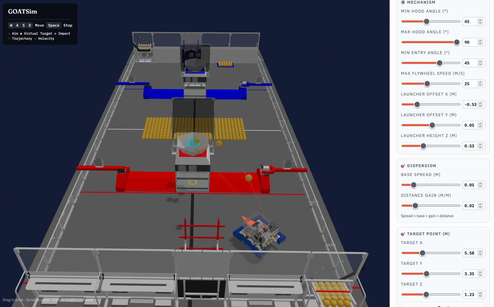

# GOATSim-Shooting (Rebuilt)

面向 FRC 2026 Rebuilt 的射球可视化工具，用物理模型模拟动态射球补偿。

[English Version](README.md)

- 在线体验: https://team-6907.github.io/u2026_Shooting_Visualizer/

<table>
  <tr>
    <td></td>
    <td></td>
  </tr>
</table>

### 功能

- 3D 场景可视化
- 基于物理模型的弹道求解（空气阻力 + 重力）
- 动态补偿：考虑机器人速度与虚拟目标
- 实时弹道/落点预测与命中判定
- Rapier 物理引擎用于飞行模拟
- 距离相关的散度模型
- 可调机构参数，右侧 Target point (m) 滑杆可调整落点计算目标

### 快速开始（本地）

```bash
git clone https://github.com/Team-6907/u2026_Shooting_Visualizer.git
cd u2026_Shooting_Visualizer
npm install
```

开发模式:

```bash
npm run dev
```

浏览器打开: `http://localhost:5173`

构建与本地预览（可选）:

```bash
npm run build
npm run preview
```

### 控制

- `WASD` - 移动机器人
- `Space` - 停止
- 鼠标拖拽 - 旋转视角
- 滚轮 - 缩放

### 致谢

- 3D 模型来自 Team 6328 的 AdvantageScope: https://docs.advantagescope.org/
